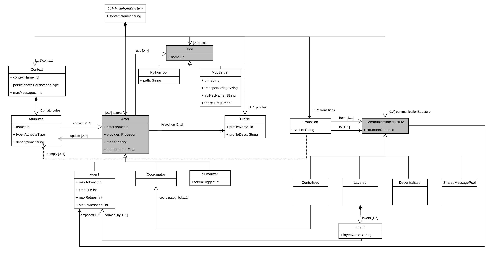

# Metamodelo

---

## Entidades

### `LLMMultiAgentSystem`

Entidad raíz del modelo. Actúa como contenedor del sistema y agrega los seis tipos de elementos que lo componen: `Context`, `Profile`, `Tool`, `Actor`, `CommunicationStructure` y `Transition`.

---

### `Context` y `Attribute`

`Context` declara el estado compartido del sistema: el único canal de información que los agentes tienen para leer y escribir entre sí. Está compuesto por cero o más `Attribute`, cada uno con un nombre (`name`), un tipo primitivo (`type`: `int`, `string` o `boolean`) y una descripción obligatoria (`description`) que el generador utiliza como metadato en los esquemas Pydantic generados.

`Context` incluye dos atributos opcionales de gestión del historial:

| Atributo | Descripción |
|---|---|
| `maxMessages` | Activa el truncado del historial conservando solo los últimos N mensajes |
| `persistence` | Mecanismo de persistencia del estado: `inMemorySave`, `postgresSave` o `mongoSave` |

---

### `Profile`

Define el prompt de sistema de un actor. Es un elemento de primer nivel reutilizable: varios actores pueden referenciar el mismo perfil sin duplicar su definición. Contiene un identificador (`name`) y el texto del prompt (`profileDescription`), declarado como cadena multilínea.

---

### `Actor`, `Agent`, `Coordinator` y `Summarizer`

`Actor` es la abstracción base de todos los participantes del grafo. Agrupa los atributos comunes:

| Atributo | Descripción |
|---|---|
| `name` | Identificador del actor |
| `provider` | Proveedor LLM: `openai`, `anthropic`, `ollama` o `google_genai` |
| `model` | Identificador del modelo concreto, validado contra una lista curada por proveedor |
| `profile` | Referencia opcional a un `Profile` |
| `temperature` | Aleatoriedad de la generación (0.0–1.0) |

El proveedor se modela como enumeración estática porque condiciona directamente los imports y las variables de entorno del proyecto generado.

De `Actor` derivan tres subtipos:

#### `Agent`

Nodo genérico del grafo. Incorpora atributos de configuración adicionales (`maxToken`, `timeOut`, `maxRetries`, `statusMessage`) y referencias al estado:

- `stateContext`: atributos que el agente lee — el generador los inyecta en su prompt en cada invocación.
- `stateUpdate`: atributos que el agente escribe — el generador construye con ellos un esquema `BaseModel` de salida estructurada.

También puede referenciar herramientas mediante `tools`.

#### `Coordinator`

Actor especializado que actúa como orquestador en una estructura `Centralized`. Solo decide a qué agente delegar en cada turno; no resuelve problemas por sí mismo ni tiene referencias al estado ni herramientas propias. Sus atributos son los mínimos heredados de `Actor`.

#### `Summarizer`

Actor especializado en comprimir el historial de mensajes. Cuando el historial supera el umbral definido por `tokenTrigger`, genera un resumen y lo almacena en el estado como campo independiente. No puede tener perfil asignado, dado que su comportamiento está completamente determinado por el generador.

---

### `PythonTool` y `MCPServer`

`Tool` es la abstracción base de las herramientas. De ella derivan dos subtipos:

**`PythonTool`** — referencia una función Python local del proyecto mediante su nombre y la ruta al módulo (`modulePath`); el generador produce el import correspondiente.

**`MCPServer`** — declara la URL de un servidor MCP remoto, el protocolo de transporte (`transport`), una clave API opcional (`apiKeyName`) y la lista de nombres de herramientas concretas a exponer (`tools`); el generador produce un cliente `MultiServerMCPClient` con esta configuración.

---

### `CommunicationStructure`

Abstracción base de las estructuras de comunicación. Los cuatro subtipos se inspiran en las topologías de comunicación identificadas en la literatura, en una interpretación simplificada:

#### `Layered`

Pipeline secuencial. Los agentes se ejecutan en el orden definido por las capas (`Layer`), cada una ocupada por exactamente un agente. La salida de una capa sirve de entrada a la siguiente, sin bifurcaciones.

#### `Centralized`

Un `Coordinator` implementado como nodo LLM recibe el contexto acumulado del sistema y, en cada turno, decide de forma autónoma a qué agente especializado delegar la ejecución. No hay lógica de enrutamiento codificada: la decisión emerge del propio modelo.

#### `Decentralized`

Cada agente está conectado al resto de agentes de la estructura. Tras ejecutarse, cada agente devuelve un `Command` de LangGraph indicando explícitamente el siguiente nodo, sin ningún coordinador central.

#### `SharedMessagePool`

Todos los agentes comparten un pool de mensajes común. Esta estructura está contemplada en el metamodelo pero pendiente de implementación en el generador.

---

### `Transition` y `Condition`

`Transition` define una arista entre dos `CommunicationStructure` a nivel de sistema, expresando el flujo de control del grafo. Contiene una referencia de origen (`from`, que puede ser `START`) y una de destino (`to`, que puede ser `END`). Opcionalmente puede incluir una `Condition` formada por:

| Campo | Descripción |
|---|---|
| `attribute` | Referencia a un `Attribute` del estado |
| `operator` | Operador de comparación: `equal`, `greater` o `lower` |
| `value` | Valor literal (`int`, `string` o `boolean`) |

Cuando existe condición, todos sus campos son obligatorios; cuando no existe, la transición es incondicional.
